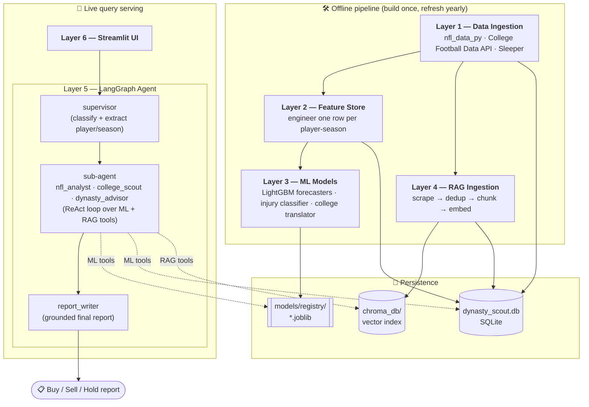

# 🏈 Dynasty Scout AI

**An AI engine that generates fantasy football insights for dynasty leagues** — combining machine-learning projections with retrieval-augmented scouting so you can make smarter buy / sell / hold and draft decisions.

---

## Why this exists

I play in a **dynasty fantasy football league** — the kind where you keep your roster year over year, so every decision is a multi-season asset-management call, not a one-week start/sit. I wanted a tool that could:

1. **Project established NFL players for the upcoming season** — grounded in injury history, prior-season production, free-agency / team movement, team fit, performance metrics, and game-tape context.
2. **Scout incoming college prospects** who have *no* NFL fantasy history — translating college production and athletic testing into a realistic NFL fantasy outlook.
3. **Recommend which players best fit a dynasty roster** — weighing short-term production against long-term value (age curve, role, draft capital), and turning it all into a plain-English buy / sell / hold verdict.

Dynasty Scout AI does all three. You ask a natural-language question; a LangGraph agent routes it, calls the right ML models and scouting-context tools, and writes a grounded report.

```
> "Is Bijan Robinson a buy or sell right now?"
> "What's the injury risk for Saquon Barkley next season?"
> "Evaluate this rookie WR for my dynasty rebuild."
```

---

## What it predicts, and from what

The models don't just look at last year's points. Each player-season is turned into a rich feature vector grouped by the signals a dynasty manager actually cares about:

| Signal you care about | How the engine captures it (feature group) |
|---|---|
| **Previous-season performance** | `fantasy_ppg_last_season`, 2yr/3yr averages, trend, games played |
| **Injury history** | games missed (1yr / 2yr), soft-tissue & ACL flags, concussion count, calibrated `injury_risk_score` |
| **Role & opportunity** | target share, air-yards share, WOPR, snap %, carries/targets per game |
| **Performance metrics / "the tape"** | EPA/play, CPOE, RYOE, YAC-above-expectation, separation, RACR, yards per target/carry |
| **Free-agency & team movement** | `new_team_flag`, `new_oc_flag` (new offensive coordinator) |
| **Team fit** | team pass rate (+ neutral script), O-line rank, plays/game, `scheme_fit_score` |
| **Age curve** | age, years of experience, `age_vs_position_peak` |
| **College prospects** | dominator rating, breakout age, draft capital, RAS / SPARQ, 40-time, vertical, college production |

Qualitative "game tape" and news context (bio, beat-reporter articles, game logs, depth-chart notes) live in a **vector store** and are retrieved on demand to explain *why* the numbers say what they say.

---

## Architecture

Dynasty Scout AI is built as **six sequential layers**, each depending on the one below it. Layers 1–4 are an offline pipeline you build once (and refresh annually); Layers 5–6 serve live queries.



### The layers in order

**Layer 1 — Data Ingestion** (`data/`, `pipeline.py`)
Pulls from three sources into a single SQLite DB (`dynasty_scout.db`): `nfl_data_py` (nflverse) for seasonal/weekly stats, NGS advanced metrics, injuries, and combine data; the College Football Data API for college production; and Sleeper's public API for ID mapping and trending data. The `players` table (GSIS `player_id`) is the central registry every other table joins to. All ingestion is idempotent.

**Layer 2 — Feature Engineering** (`data/features/engineer.py`)
Reads the raw stat tables and writes one engineered row per player-season into `engineered_features` — the only table the models read from. `pipeline.load_features_for_ml()` is the single entry point for training data; `pipeline.get_feature_columns()` exposes the feature groups above for ablation.

**Layer 3 — ML Models** (`models/`)
Three model families, all inheriting `DynastyModel` (MLflow tracking + joblib persistence + SHAP → plain-English factor strings):
- **`NFLPerformanceForecaster`** — LightGBM quantile regression (α = 0.1 / 0.5 / 0.9), one model per position → next-season PPR PPG with floor/ceiling for **established players**.
- **`InjuryRiskModel`** — calibrated logistic regression (Platt scaling) → an honest injury *probability*, not just a rank.
- **`CollegeToNFLTranslator`** — RidgeCV + KNN historical-comp lookup → projected NFL fantasy output for **rookies with no NFL history** (chosen over gradient boosting because the prospect dataset is tiny). `ModelStore` is the unified inference API and auto-routes veterans vs. rookies.

**Layer 4 — RAG Pipeline** (`rag/`)
Scrapes NFL.com bios, ESPN profiles/news, Sleeper status, and game logs; deduplicates by content hash into the `scouting_documents` table; chunks and embeds into **ChromaDB** using a local `all-MiniLM-L6-v2` model (no API key). Retrieval tools are `@tool`-decorated for the agent, with cold-start on-demand ingestion if a player isn't indexed yet.

**Layer 5 — LangGraph Agent** (`agent/`)
The brain. A **supervisor** node classifies the query (`nfl_analysis` / `college_scouting` / `dynasty_advice`) and extracts the player + season; it routes to one **sub-agent** (a ReAct agent bound to the ML + RAG tools) which gathers projections and scouting context; a tool-less **report_writer** synthesizes the final grounded answer. `agent.run.ask_dynasty_scout(query)` is the one function every caller uses.

**Layer 6 — Streamlit UI** (`app/streamlit_app.py`)
A thin chat interface over `ask_dynasty_scout()` with a sidebar showing vector-store coverage. All reasoning lives below it.

---

## Tech stack

- **Language:** Python 3.11
- **ML:** LightGBM, scikit-learn, SHAP, MLflow
- **Agent / LLM:** LangGraph + LangChain, Anthropic Claude
- **RAG:** ChromaDB, `sentence-transformers` (all-MiniLM-L6-v2), BeautifulSoup (+ optional Playwright)
- **Data:** `nfl_data_py`, College Football Data API, Sleeper API, SQLite / SQLAlchemy
- **UI:** Streamlit

---

## Getting started

### 1. Prerequisites
- Python 3.11
- An **Anthropic API key** (the agent calls Claude)
- *(Optional)* a **College Football Data API key** — only needed to (re)ingest college data

### 2. Install

```bash
git clone <repo-url>
cd dynasty-ai-engine

python3.11 -m venv .venv
source .venv/bin/activate
pip install -r requirements.txt
```

### 3. Configure credentials

```bash
export ANTHROPIC_API_KEY="sk-ant-..."     # required for the agent
export CFBD_API_KEY="..."                 # optional, college ingestion only
```

> The repo ships with a pre-built `dynasty_scout.db`, `chroma_db/`, and trained models in `models/registry/`, so you can **skip straight to "Run the agent"** if you just want to try it. Steps 4–6 rebuild everything from scratch.

### 4. (Rebuild) Build the data + feature store

```bash
# First-time full historical backfill
python pipeline.py --backfill --start-year 2015 --end-year 2024 --cfbd-key $CFBD_API_KEY

# Each new season, just refresh
python pipeline.py --refresh --year 2025
```

### 5. (Rebuild) Train the models

```python
from models.model_store import ModelStore
store = ModelStore()
store.train_all()   # writes models/registry/*.joblib ; view runs with `mlflow ui`
```

### 6. (Rebuild) Ingest scouting context into the vector store

```bash
python -m rag.ingestion_pipeline --all                          # everyone
python -m rag.ingestion_pipeline --player-name "Justin Jefferson"   # one player (quick test)
python -m rag.ingestion_pipeline --incremental                  # embed already-scraped docs
```

### 7. Run the agent

```bash
# One-off question
python -m agent.run --query "Is Bijan Robinson a buy or sell right now?"

# Interactive REPL
python -m agent.run --interactive
```

### 8. Run the web app

```bash
streamlit run app/streamlit_app.py
```

---

## Example questions

| Question | Routes to | What it does |
|---|---|---|
| *"Is Bijan Robinson a buy or sell right now?"* | dynasty advisor | ML projection + scouting context → buy/sell/hold |
| *"What's the injury risk for Saquon Barkley next season?"* | NFL analyst | calibrated injury probability + history |
| *"Evaluate this rookie WR for my dynasty rebuild."* | college scout | college-translation projection + draft profile |
| *"Should I trade Player A for Player B?"* | dynasty advisor | projects **both** players, compares asset value |

---

## Project layout

```
dynasty-ai-engine/
├── pipeline.py            # Layer 1–2 orchestrator + load_features_for_ml()
├── data/                  # ingestion, schema, feature engineering
├── models/                # Layer 3: forecasters, injury, college translator, ModelStore
│   └── registry/          #   trained *.joblib artifacts
├── rag/                   # Layer 4: scrapers, vector store, retrieval tools, ingestion
├── agent/                 # Layer 5: LangGraph supervisor graph, tools, runtime guard
├── app/                   # Layer 6: Streamlit UI
├── dynasty_scout.db       # SQLite: all structured data
├── chroma_db/             # vector index of scouting docs
└── CLAUDE.md              # architecture notes for AI coding assistants
```

---

## Troubleshooting

- **Agent 401s / auth error** — `ANTHROPIC_API_KEY` isn't set in the shell you're running from.
- **Segfault (exit 139) on macOS** — caused by multiple bundled OpenMP runtimes (LightGBM + PyTorch + scikit-learn). Handled automatically by `agent/runtime.py`, which forces single-threaded OpenMP before the native libraries load; keep it imported first in any new entry point.
- **PFR game-log scraping fails** — Pro-Football-Reference is behind Cloudflare; `nfl_data_py` is the primary source and provides identical data. To enable the optional browser fallback: `pip install playwright && playwright install chromium` (see `SETUP_PLAYWRIGHT.md`).
- **"College Translator QB/RB not found"** — only WR/TE translators ship by default; regenerate the rest with `ModelStore().train_all()`.

---

## Status & caveats

This is a personal project for dynasty-league decision support, not financial or professional advice. Projections are model estimates with real uncertainty — the reports surface confidence levels and floor/ceiling ranges precisely so you can weigh them yourself. There is no automated test suite yet; validate changes by running the relevant layer directly.
